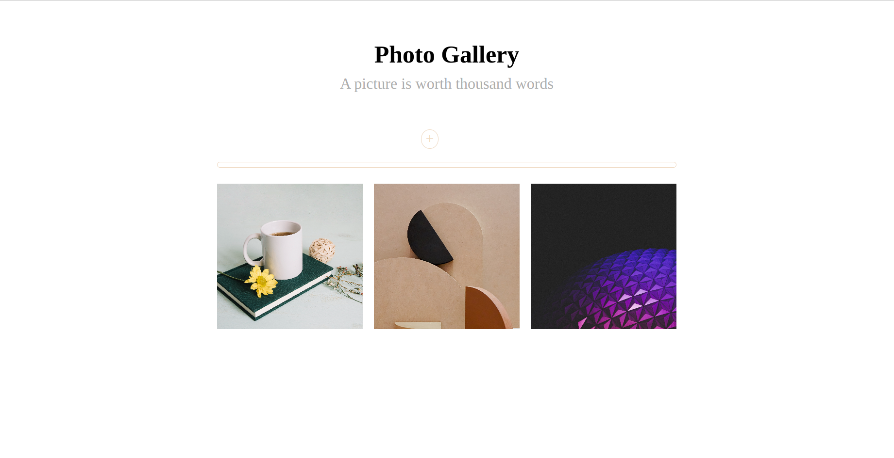

# Image Gallery

An Image Gallery built with React,NodeJs and Multer.

## Technologies Used

- React
- NodeJs- Multer
- Express
- Middleware - cors

## Installation Guide

### Client side

```
npm create vite@latest Client
cd Client
npm install
npm install react-router-dom
npm run dev
```

### Server side

Inside Folder Server

```
npm init
npm install nodemon -D
npm i express
npm i cors
npm i multer
```

- Install NodeJs
- Install npm: `npm init`
- Install Nodemon:`npm install nodemon -D`
- Install Express:`npm install express`
- Install Cors:`npm install cors`
- Go to `package.json` and rewrite the scripts as

  ```
  "scripts": {
  "dev": "nodemon index.js",
  "start": "node index.js"
  }`

  ```

- Start the server: `npm run dev`

#### Note:Multer is a node.js middleware for handling multipart/form-data, which is primarily used for uploading files.


